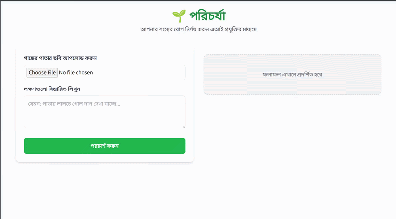

# 🌱 Porichorja (পরিচর্যা)

Porichorja is an agriculture and livestock related QnA system focused on Bangladesh. It uses RAG to provide reliable and context-aware responses.

### Demonstration



## 🛠 Project Structure
```text
porichorja/
├── assets/           # Project assets (images, gifs)
├── backend/
│   ├── data/         # RAG data files (embeddings, index, CSV)
│   ├── ai_engine.py  # Inference logic with Ollama
│   └── main.py       # FastAPI server
├── frontend/
│   ├── index.html    # Web UI (Tailwind CSS)
│   └── script.js     # Frontend logic
├── .env              # Environment variables (API Keys)
├── .gitignore        # Ignored files
├── requirements.txt  # Python dependencies
└── README.md         # Project documentation
```

## ⚙️ Setup Instructions

### Backend
1. Create a `.env` file in the root directory.
2. Add your Ollama API key: `OLLAMA_API_KEY=your_key_here`.
3. (Optional) Add your Hugging Face token if using HF models: `HF_TOKEN=your_token_here`.
4. Install dependencies:
   ```bash
   pip install -r requirements.txt
   ```
5. Run the backend:
   ```bash
   fastapi dev backend/main.py
   ```

### Frontend
- Open `frontend/index.html` in any modern web browser.

